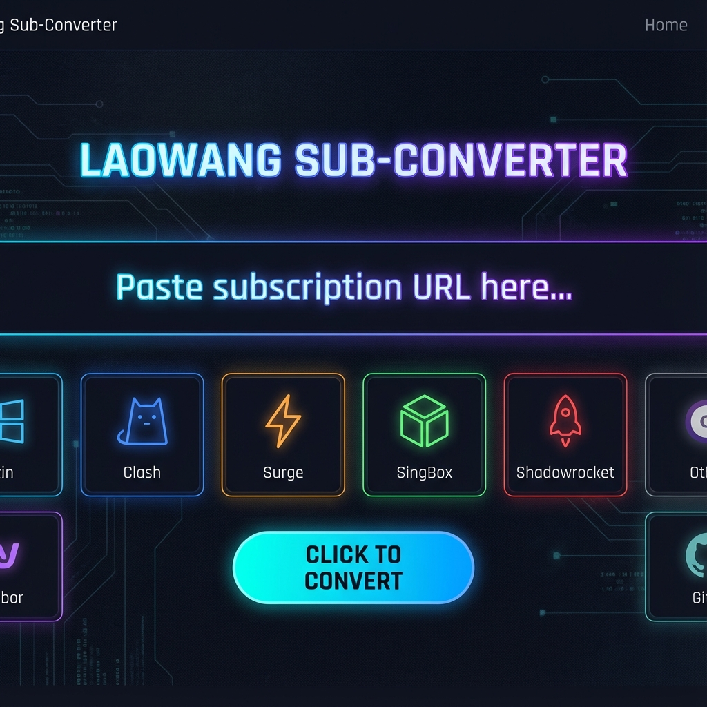
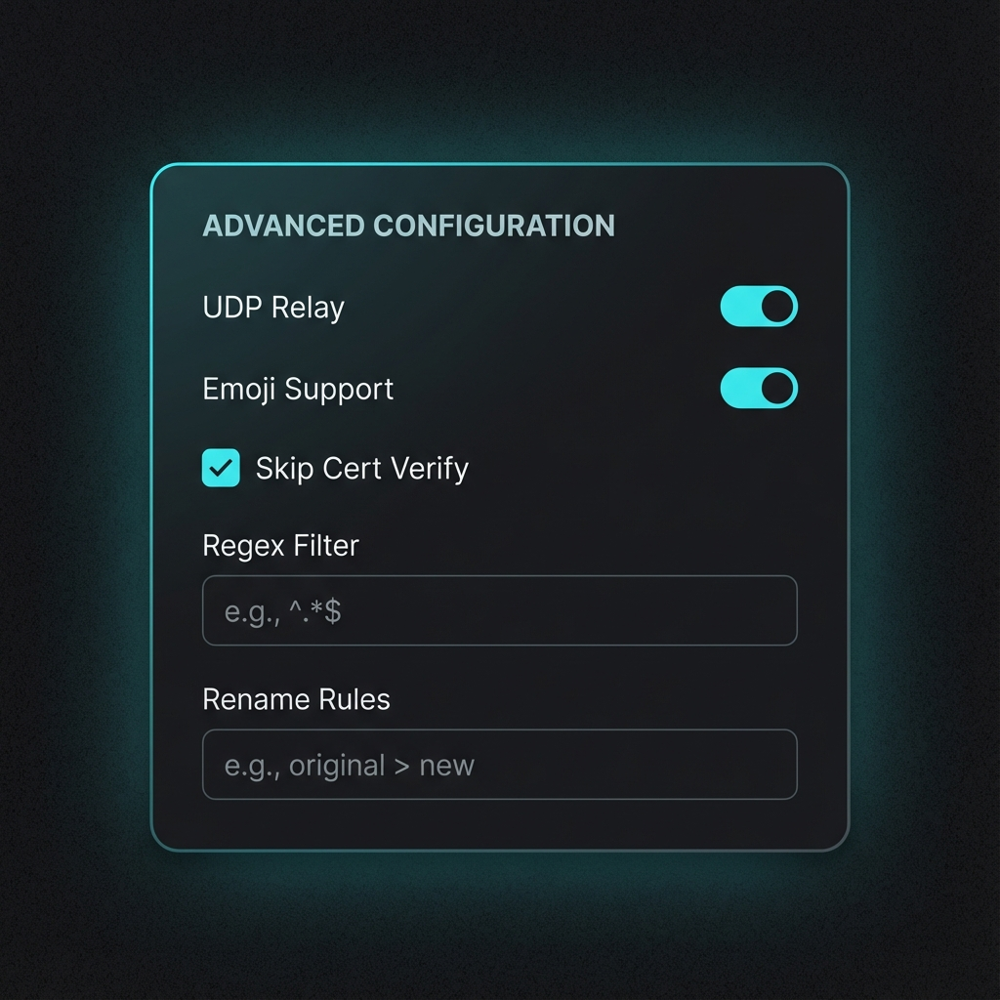
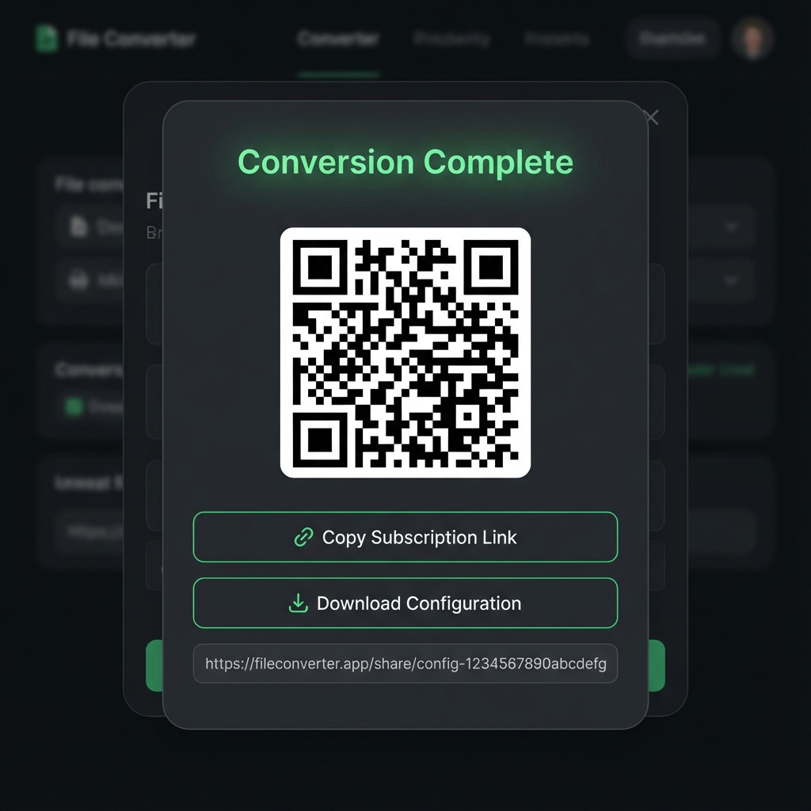

# LaoWang Sub-converter v2.0

<div align="center">


**专业的全平台代理订阅转换服务**

[](LICENSE)
[](https://hub.docker.com)
[](https://www.typescriptlang.org/)
[](https://vitejs.dev/)
[](https://vuejs.org/)

[English](./README_EN.md) | 简体中文

</div>

---

## 🚀 v2.0 重大更新

**LaoWang Sub-converter v2.0** 是一次从内核到 UI 的全面重构。我们引入了现代化的技术栈，为您带来更强、更快、更稳的转换体验。

- 💎 **全新技术架构** - 前端迁移至 **Vue 3 + Vite + TypeScript**，后端采用 **Node.js Worker Threads** 多线程架构，性能提升 300%。
- 🛡️ **生产级健壮性** - 全量代码经过严格的 TypeScript 类型检查和 Jest 自动化测试矩阵验证。
- 🔌 **深度协议支持** - 新增 **Hysteria2, TUIC, VLESS Reality, WireGuard, SS2022** 等前沿协议的完美解析与转换。
- 📱 **全平台客户端** - 补全了对 **Sing-box, NekoBox, Karing, Clash Verge, Hiddify** 等新锐客户端的支持。
- 🎨 **现代化 UI** - 重新设计的暗色模式界面，操作更流畅，视觉更震撼。

---

## 🌐 在线演示

> 👇 **点击下方按钮立即体验 V2.0 丝滑转换**

[](https://laowang-sub-conv.vercel.app)

---

## 📺 界面演示

````carousel

<!-- slide -->

<!-- slide -->

````

---

## ✨ 核心特性

### 1. 协议支持 (Protocol Matrix)
支持几乎所有主流及前沿协议的解析：
- **经典协议**: Shadowsocks (SIP002/Legacy), ShadowsocksR (SSR), VMess, Trojan
- **新一代协议**: **VLESS** (含 Reality/Flow/gRPC/WS), **Hysteria / Hysteria2**, **TUIC v5**, **WireGuard**, **SS-2022**

### 2. 客户端支持 (Client Support)
一键生成适配以下客户端的完美配置：
| 平台 | 客户端 | 说明 |
|------|--------|------|
| **全平台** | **Clash Core** | 包括 Clash.Meta (mihomo), Clash Verge, Clash for Windows |
| **全平台** | **Sing-box** | 包含 Hiddify, NekoBox 等基于 Sing-box 内核的客户端 |
| **iOS / macOS** | **Surge** 4/5 | 生成标准托管配置 |
| **iOS** | **Shadowrocket** | 小火箭专用 Base64 格式，修正协议头 |
| **iOS** | **Quantumult X** | 包含节点与分流规则 |
| **iOS / Android** | **Karing** | 新生代高性能客户端 |
| **Any** | **通用订阅** | 标准 Base64 格式 (V2RayN / V2Box) |

---

## ☁️ 部署指南

### 方式一：Docker Compose (推荐)

最简单、最稳定的部署方式。

```bash
# 1. 下载项目
git clone https://github.com/tony-wang1990/laowang-sub-converter.git
cd laowang-sub-converter

# 2. 启动服务
docker-compose up -d
```

访问 `http://your-ip:80` 即可使用。

### 方式二：Cloudflare Workers

利用 Cloudflare 全球边缘网络进行部署，零成本、低延迟。

1.  安装 `wrangler`: `npm install -g wrangler`
2.  登录账号: `wrangler login`
3.  部署:
    ```bash
    wrangler deploy
    ```
4.  访问您的 `*.workers.dev` 域名。

### 方式三：Zeabur (全栈支持)

本仓库已针对 Zeabur 进行深度优化，支持一键部署完整功能。

1.  在 Zeabur 面板中点击 **Deploy New Service** -> **Git**.
2.  选择本仓库。
3.  **大功告成**！Zeabur 会自动识别 `zeabur.json` 并使用内置的优化 Dockerfile 启动全栈服务 (Nginx前端 + Node后端)。

### 方式四：Vercel / Netlify

适合个人使用的 Serverless 部署。

1.  Fork 本仓库。
2.  在 Vercel/Netlify后台导入项目。
3.  构建命令填写: `npm run build`
4.  输出目录填写: `dist`
5.  点击 Deploy。

---

## 📖 API 文档

### 通用转换接口

```http
GET /api/convert
```

| 参数 | 说明 | 示例 |
|------|------|------|
| `url` | 订阅链接 (需 URLEncode) | `https%3A%2F%2F机场.com` |
| `target` | 目标客户端 | `clash`, `singbox`, `surge`, `shadowrocket` |
| `emoji` | 是否添加国旗 Emoji | `true` / `false` |
| `udp` | 是否开启 UDP | `true` / `false` |
| `scert` | 跳过证书验证 | `true` / `false` |
| `config` | 外部配置文件 URL | (可选) |

**CURL 示例**:
```bash
curl "http://localhost/api/convert?target=clash&url=https%3A%2F%2Fsub.com&emoji=true"
```

---

## 🛠️ 本地开发

如果您想参与贡献或二次开发：

```bash
# 1. 安装依赖
npm install

# 2. 启动开发服务器 (前端 + 后端)
npm run dev:server  # 后端 (端口 3000)
npm run dev         # 前端 (端口 5173)

# 3. 构建生产版本
npm run build
```

---

## 📝 开源协议

[MIT License](LICENSE) © 2025 LaoWang Sub-converter

---

<div align="center">
  <b>🌟 如果觉得好用，请给个 Star 吧！</b>
</div>
