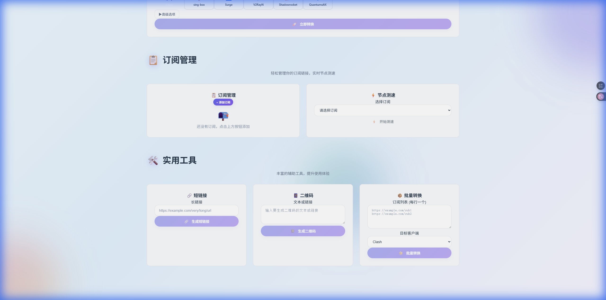
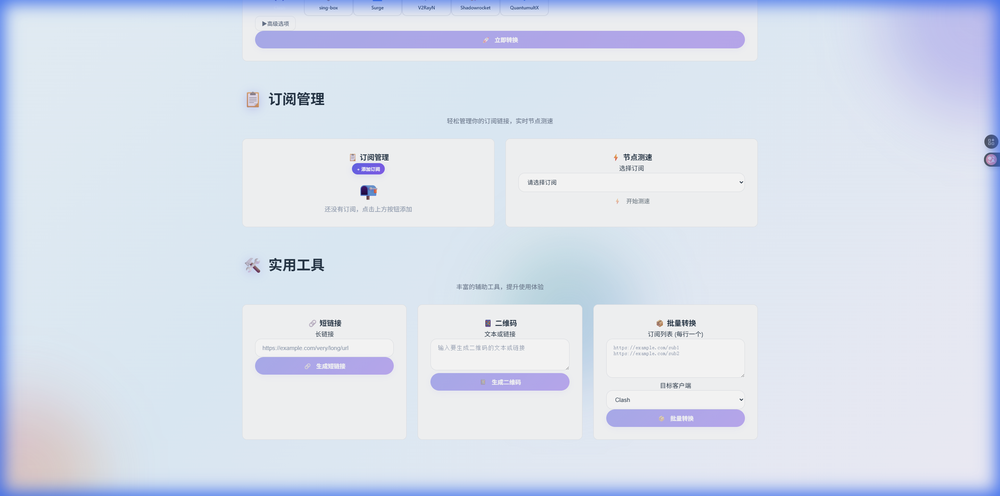

# 🚀 LaoWang SubConverter V2.0

<p align="center">
  
</p>

<p align="center">
  <strong>现代化的订阅转换工具 | Modern Subscription Converter</strong>
</p>

<p align="center">
  <a href="https://laowang-sub.zeabur.app">🌐 在线演示</a> •
  <a href="#功能特性">✨ 功能特性</a> •
  <a href="#部署指南">📦 部署指南</a> •
  <a href="#使用说明">📖 使用说明</a>
</p>

---

## ✨ 功能特性

### 🔄 快速转换
- **多客户端支持**: Clash, V2RayN, Shadowrocket, QuantumultX, Surge, sing-box 等 20+ 客户端
- **多协议支持**: VMess, VLESS, Trojan, Shadowsocks, Hysteria2 等
- **单节点转换**: 直接粘贴节点链接即可转换
- **批量转换**: 支持多订阅地址同时转换

### 📋 订阅管理
- **订阅存储**: 本地保存常用订阅链接
- **一键测速**: 批量检测节点可用性和延迟
- **实时统计**: 显示订阅总数、转换次数等

### 🛠️ 实用工具
- **短链接生成**: 将长订阅链接转为短链接
- **二维码生成**: 生成节点/订阅的二维码
- **批量处理**: 批量转换多个订阅

### 🎨 界面设计
- **现代UI**: 简洁美观的界面设计
- **多主题**: 深邃蓝、海洋蓝、森林绿、玫瑰红等 8 种主题
- **响应式**: 完美适配桌面和移动端

---

## 📸 界面预览

### 首页 - 快速转换
<p align="center">
  
</p>

### 订阅管理 & 节点测速
<p align="center">
  
</p>

### 实用工具
<p align="center">
  
</p>

---

## � 部署指南

### 方式一：Zeabur 一键部署（推荐）

[](https://zeabur.com/templates/XXXXXXX)

1. 点击上方按钮
2. 选择 GitHub 账号授权
3. 等待自动部署完成

### 方式二：Docker 部署

```bash
# 拉取镜像
docker pull ghcr.io/tony-wang1990/laowang-sub-converter-v2:latest

# 运行容器
docker run -d \
  --name laowang-sub \
  -p 3000:3000 \
  ghcr.io/tony-wang1990/laowang-sub-converter-v2:latest
```

**使用 Docker Compose:**

```yaml
version: '3.8'
services:
  laowang-sub:
    image: ghcr.io/tony-wang1990/laowang-sub-converter-v2:latest
    container_name: laowang-sub
    ports:
      - "3000:3000"
    restart: unless-stopped
```

```bash
docker-compose up -d
```

### 方式三：VPS 手动部署

```bash
# 克隆项目
git clone https://github.com/tony-wang1990/laowang-sub-converter-v2.git
cd laowang-sub-converter-v2

# 安装依赖
npm install

# 构建前端
npm run build

# 构建服务端
npm run build:server

# 启动服务
npm start
```

### 方式四：开发环境

```bash
# 克隆项目
git clone https://github.com/tony-wang1990/laowang-sub-converter-v2.git
cd laowang-sub-converter-v2

# 安装依赖
npm install

# 启动开发服务器
npm run dev

# 另开终端启动后端
npm run dev:server
```

---

## 📖 使用说明

### 快速转换

1. **输入订阅链接或节点链接**
   - 支持订阅 URL: `https://example.com/sub`
   - 支持节点链接: `vmess://...`, `vless://...`, `trojan://...` 等

2. **选择目标客户端**
   - 点击对应客户端图标选择

3. **点击转换**
   - 获取转换后的订阅链接
   - 可复制链接或下载配置文件

### 高级选项

- **过滤节点**: 使用正则表达式筛选节点名称
- **排除节点**: 排除包含特定关键词的节点
- **节点重命名**: 自定义节点名称格式
- **去重**: 自动去除重复节点

---

## 🔧 技术栈

- **前端**: Vue 3 + TypeScript + Vite
- **后端**: Node.js + Express + TypeScript
- **样式**: 原生 CSS + CSS Variables
- **部署**: Docker + Zeabur

---

## 📁 项目结构

```
laowang-sub-converter-v2/
├── src/                    # 前端源码
│   ├── assets/            # 静态资源
│   ├── components/        # Vue 组件
│   ├── views/             # 页面组件
│   └── router/            # 路由配置
├── server/                 # 后端源码
│   ├── routes/            # API 路由
│   └── utils/             # 工具函数
├── docs/                   # 文档和截图
├── Dockerfile             # Docker 构建文件
├── zeabur.yaml            # Zeabur 配置
└── package.json           # 项目配置
```

---

## 🌐 API 文档

### 订阅转换

```http
GET /api/convert
```

| 参数 | 类型 | 说明 |
|------|------|------|
| url | string | 订阅链接 (必填) |
| target | string | 目标客户端 (必填) |
| include | string | 包含关键词 (可选) |
| exclude | string | 排除关键词 (可选) |

### 短链接生成

```http
POST /api/shorten
Content-Type: application/json

{
  "url": "https://example.com/very-long-url"
}
```

### 节点测速

```http
GET /api/speedtest?url={订阅链接}
```

---

## � 更新日志

### V2.0 (2024-12)
- 🎨 全新现代化 UI 设计
- ⚡ 单节点直接转换支持
- 🚀 多主题切换
- 📊 实时统计功能
- 🔗 短链接生成
- 📱 二维码生成
- 🏃 节点测速功能

---

## 🤝 贡献

欢迎提交 Issue 和 Pull Request！

---

## � 许可证

MIT License © 2024 [Tony Wang](https://github.com/tony-wang1990)

---

<p align="center">
  如果这个项目对你有帮助，请给一个 ⭐️ Star！
</p>
